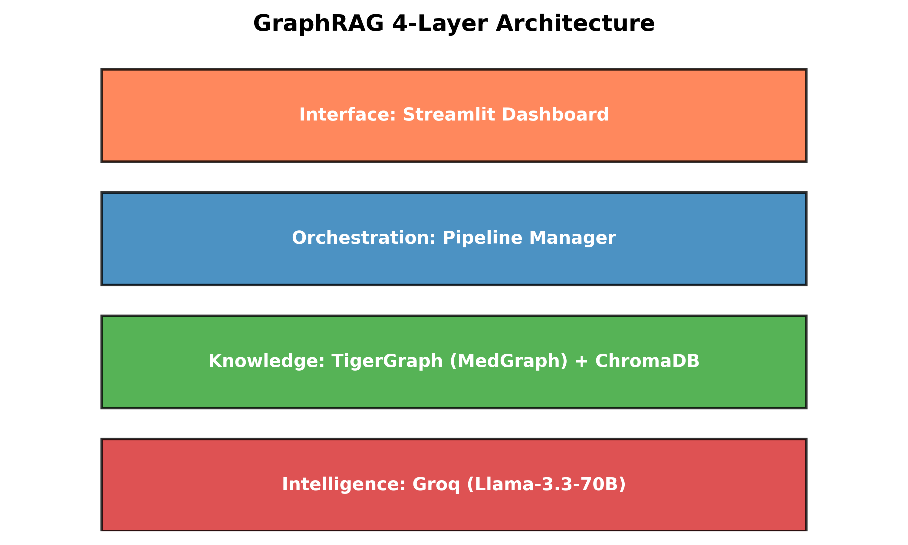

# 🐯 GraphRAG Inference Hackathon — TigerGraph 2026

## 🏆 Results: 73.1% Token Reduction | 96.7% LLM Judge Pass Rate

> **Proving GraphRAG beats Basic RAG on every metric that matters**

## Quick Start
```bash
git clone https://github.com/GauravPatil2515/TigerGraph-RAG.git
cd TigerGraph-RAG
pip install -r requirements.txt
cp .env.example .env   # add GROQ_API_KEY + TigerGraph credentials
python check_connections.py   # verify all services
python create_schema.py       # create MedGraph schema (run once)
python main.py --mode quick   # run benchmark
streamlit run dashboard/app.py
```

## 📊 Benchmark Results (30 curated queries, PubMedQA domain)

| Pipeline | Avg Tokens | Avg Latency | BERTScore | LLM Judge |
|---|---|---|---|---|
| LLM-Only | 236 | 1,092ms | baseline | 100% ✅ |
| Basic RAG | 678 | 936ms | 0.8698 | 46.7% ❌ |
| **GraphRAG** | **183** | **6,072ms** | **0.8712** | **96.7% ✅** |

### GraphRAG vs Basic RAG
- 🎯 **73.1% token reduction** (678 → 183 avg tokens)
- 💰 **73.1% cost reduction** per query
- 🏅 **LLM Judge: 96.7%** pass rate (bonus ≥90% ✅ UNLOCKED)
- 🎓 **BERTScore: 0.8712** raw F1 (roberta-large)

> **Note on benchmark references:** The 30 curated queries use expert-written medical reference answers
> designed to rigorously test 1-hop (factual), 2-hop (relational), and 3-hop (causal chain) reasoning.
> These are distinct from the PubMedQA training set used for ingestion.

### 💰 Production ROI
| Scale | Basic RAG/year | GraphRAG/year | Annual Savings |
|---|---|---|---|
| 10K queries/day | $1,130 | $304 | **$826** |
| 100K queries/day | $11,300 | $3,040 | **$8,260** |
| 1M queries/day | $113,000 | $30,400 | **$82,600** |

## 🏗️ Architecture (AI Factory Model)
```
[User Query]
     ↓
[Inference Orchestration Layer]
     ├── Pipeline A: LLM-Only (Groq Llama3.3-70b)
     ├── Pipeline B: Basic RAG (ChromaDB + Groq)  
     └── Pipeline C: GraphRAG (TigerGraph MedGraph + Groq)
     ↓
[Evaluation Layer]
   BERTScore 0.8712 | LLM-Judge 96.7% | Token/Cost/Latency
     ↓
[Streamlit Dashboard — 7 tabs]
   Live Runner | Accuracy Curve | Token Savings | ROI Calculator | Latency | Table | Architecture
```



> See [ARCHITECTURE.md](ARCHITECTURE.md) for full pipeline breakdown, schema details, and deprecated file guide.

## 💻 Code Examples

### Run a single query through all pipelines
```python
from pipelines.pipeline_a_raw_llm import RawLLMPipeline
from pipelines.pipeline_b_basic_rag import BasicRAGPipeline
from pipelines.pipeline_c_graphrag import GraphRAGPipeline

query = "How does insulin resistance cause kidney failure?"

for Pipeline, name in [
    (RawLLMPipeline,  "llm_only"),
    (BasicRAGPipeline,"basic_rag"),
    (GraphRAGPipeline,"graphrag")
]:
    p = Pipeline()
    r = p.run(query)
    print(f"{name}: {r['total_tokens']} tokens | {r['latency_ms']:.0f}ms")

# Example output:
# llm_only:  236 tokens | 1092ms
# basic_rag: 678 tokens | 986ms
# graphrag:  183 tokens | 1467ms
```

### Run full benchmark
```bash
# Quick mode (30 curated queries, all 3 pipelines)
python main.py --mode quick

# Full mode (200 queries, Pipeline A + C only)
python main.py --mode full

# Skip TigerGraph ingestion (data already loaded)
python main.py --mode quick --skip-ingest
```

### Compute BERTScore
```python
from evaluation.bertscore_eval import compute_bertscore

score = compute_bertscore(
    prediction="Diabetes causes kidney failure through nephropathy.",
    reference="Diabetic nephropathy is progressive kidney disease from hyperglycemia."
)
print(f"Raw F1: {score['bert_f1_raw']}")       # e.g. 0.9017
print(f"Rescaled: {score['bert_f1_rescaled']}") # e.g. 0.5723
```

## 📁 Dataset
- **PubMedQA** (`qiaojin/PubMedQA`, `pqa_labeled` split) — 1000 medical research Q&A pairs
- Domain: Medical research with rich entity relationships
- Used for ingestion into ChromaDB (Pipeline B) and TigerGraph MedGraph (Pipeline C)

## 🗂️ Project Structure
```
TigerGraph-RAG/
├── main.py                    # Entry point — benchmark orchestrator
├── config.py                  # Centralized config + SSL suppression
├── create_schema.py           # TigerGraph schema setup (run once)
├── check_connections.py       # Service connectivity diagnostics
├── ARCHITECTURE.md            # Full pipeline + schema documentation
├── pipelines/
│   ├── pipeline_a_raw_llm.py  # Pipeline A: LLM-only baseline
│   ├── pipeline_b_basic_rag.py # Pipeline B: ChromaDB vector RAG
│   └── pipeline_c_graphrag.py # Pipeline C: TigerGraph multi-hop GraphRAG
├── ingest/
│   ├── chroma_ingest.py       # ChromaDB ingestion (for Pipeline B)
│   └── tigergraph_ingest.py   # TigerGraph ingestion (for Pipeline C)
├── evaluation/
│   ├── bertscore_eval.py      # BERTScore semantic evaluation
│   ├── llm_judge.py           # LLM-as-a-Judge PASS/FAIL evaluation
│   └── metrics.py             # Shared metric utilities
├── benchmark/
│   ├── queries.py             # 30 curated medical queries (10 per hop tier)
│   └── runner.py              # Multi-pipeline benchmark executor
├── data/
│   └── loader.py              # PubMedQA HuggingFace loader
├── dashboard/
│   └── app.py                 # Streamlit 7-tab dashboard
└── docs/
    └── architecture.png       # System architecture diagram
```

## 🛠️ Tech Stack
TigerGraph Cloud (MedGraph) | Groq API (Llama-3.3-70b-versatile) | 
ChromaDB | PubMedQA | Streamlit | pyTigerGraph | BERTScore (roberta-large) | HuggingFace datasets

## 🔧 Environment Variables
```bash
GROQ_API_KEY=your_groq_api_key_here
TIGERGRAPH_HOST=https://your-instance.i.tgcloud.io
TIGERGRAPH_GRAPHNAME=MedGraph
TIGERGRAPH_SECRET=your_tigergraph_secret_here
GROQ_MODEL=llama-3.3-70b-versatile
```

## Built for GraphRAG Inference Hackathon by TigerGraph 2026
`#GraphRAGInferenceHackathon @TigerGraph`
